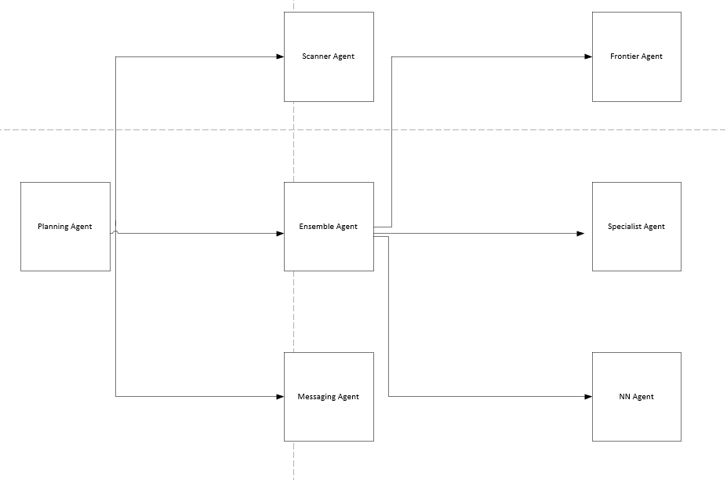

# FlipFinder

[](https://github.com/TumeloKonaite/FlipFinder/actions/workflows/ci.yml) [](https://www.python.org/downloads/) [](https://developer.hashicorp.com/terraform) [](https://github.com/TumeloKonaite/FlipFinder/blob/main/LICENSE)

FlipFinder is a multi-agent pricing system for e-commerce deal discovery. It combines retrieval-based pricing, fine-tuned model inference, neural-network pricing, and orchestration agents into a deployable AWS-based platform for identifying potentially profitable listings.

## What FlipFinder Does

FlipFinder scans candidate listings, estimates fair value using multiple pricing strategies, and flags promising opportunities.

It combines:
- **FrontierAgent** for retrieval-based pricing
- **SpecialistAgent** for fine-tuned model inference on SageMaker
- **NNAgent** for classical neural-network inference in a Lambda container
- **EnsembleAgent** for weighted price aggregation
- **ScannerAgent** for deal discovery
- **PlanningAgent** for orchestration, thresholding, and alerting

Infrastructure is deployed with Terraform from:

- `src/terraform/Platform`

## Architecture



### Core Runtime Components

- **EmbeddingEndpoint** - SageMaker serverless endpoint for sentence embeddings
- **SpecialistAgent** - SageMaker realtime endpoint with Lambda wrapper for fine-tuned pricing
- **NNAgent** - Lambda container running a local PyTorch pricing model
- **FrontierAgent** - Lambda function using embeddings, S3 Vectors retrieval, and OpenAI pricing
- **EnsembleAgent** - Lambda function combining Frontier, Specialist, and NN outputs
- **ScannerAgent** - Lambda + EventBridge + DynamoDB workflow for periodic deal scans
- **PlanningAgent** - Lambda + SNS orchestration for pricing decisions and notifications

### High-Level Flow

1. `ScannerAgent` finds candidate deals
2. `EnsembleAgent` preprocesses the listing and fans out to Frontier, Specialist, and NN
3. `EnsembleAgent` returns a weighted price estimate
4. `PlanningAgent` applies business rules and sends alerts through SNS

## Repository Layout

```text
src/
  agents/              Agent implementations
  terraform/           Terraform modules
  dataset_ingestion/   Product ingestion scripts for S3 + S3 Vectors

docs/                  Deployment and component guides
scripts/               Operational utilities and smoke tests
notebooks/             Experiments and data preparation
```

Main deployment path:

- `src/terraform/Platform`

## Prerequisites

### Required

- AWS account with CLI credentials configured
- Terraform `>= 1.5`
- Docker with buildx
- Python `>= 3.12`
- IAM permissions for:
  - Lambda
  - ECR
  - SageMaker
  - IAM
  - CloudWatch
  - EventBridge
  - DynamoDB
  - SNS
  - Bedrock
  - S3 Vectors

### Recommended

- `uv` for local Python environment management
- GitHub Actions for CI (already configured in `.github/workflows/ci.yml`)

### Notes

- Terraform build/package steps are currently Windows-oriented (`cmd` / PowerShell via `local-exec`)
- NN model weights are downloaded during Docker build from Google Drive and can be overridden via Terraform variables

## Quick Start (Local Python)

Using `uv`:

```bash
uv sync
```

Using `pip`:

```bash
python -m pip install --upgrade pip
pip install -r requirements.txt
```

## Deploy the Full Stack

### 1. Open the Platform module

```bash
cd src/terraform/Platform
```

### 2. Create `terraform.tfvars`

Command Prompt:

```bash
copy terraform.tfvars.example terraform.tfvars
```

PowerShell:

```powershell
Copy-Item terraform.tfvars.example terraform.tfvars
```

### 3. Set required values

At minimum, set:

- `specialist_finetuned_model`
- one OpenAI credential strategy:
  - `openai_api_key`, or
  - `openai_api_key_secret_arn`, or
  - `openai_api_key_ssm_parameter_name`

Optional but commonly needed:

- `huggingface_api_token` if model repositories are gated
- `nn_weights_drive_folder_url` for NN image builds
- `frontier_vector_bucket` and `frontier_index_name` if you already have an ingested vector index

Important example defaults:

- `auto_build_container_images = true`
- `nn_weights_drive_folder_url` points to a Google Drive folder

### Configuration Checklist

| Variable | Required for `terraform apply` | Required for working runtime | Notes |
| --- | --- | --- | --- |
| `specialist_finetuned_model` | Yes | Yes | No default |
| `openai_api_key` or `openai_api_key_secret_arn` or `openai_api_key_ssm_parameter_name` | No | Yes | Needed by Frontier/Scanner |
| `huggingface_api_token` | No | Sometimes | Needed for gated model repos |
| `nn_weights_drive_folder_url` | No | Yes | Must contain a `.pth` model file |
| `frontier_vector_bucket` / `frontier_index_name` | No | Yes | Should point to a populated S3 Vectors index |
| `messaging_email_endpoint` | No | Optional | Requires SNS email confirmation |

### Minimal `terraform.tfvars` example

```hcl
aws_region     = "us-east-1"
project_prefix = "pricing"

specialist_finetuned_model = "TumeloKonaite/<your-price-model-repo>"

# Choose ONE OpenAI strategy
openai_api_key                    = ""
openai_api_key_secret_arn         = "arn:aws:secretsmanager:us-east-1:123456789012:secret:openai-key"
openai_api_key_ssm_parameter_name = ""

huggingface_api_token       = ""
nn_weights_drive_folder_url = "https://drive.google.com/drive/folders/1uq5C9edPIZ1973dArZiEO-VE13F7m8MK?usp=drive_link"
```

### 4. Deploy

```bash
terraform init
terraform apply
```

This provisions the full platform, including:

- embedding endpoint
- specialist agent
- NN agent
- frontier agent
- ensemble agent
- scanner agent
- planning agent

### 5. Capture outputs

```bash
terraform output
```

Use the outputs for Lambda names, endpoint names, SNS topic ARNs, and related runtime values.

## Secrets and Safety

This repository is configured to avoid committing local secrets and generated state:

- `.env` and `.env.*` ignored
- `*.tfvars` ignored except `*.tfvars.example`
- `*.tfstate*` ignored
- generated Lambda zip/build artifacts ignored

Do not store real secrets in tracked files.

Preferred secret strategies:

- AWS Secrets Manager via `openai_api_key_secret_arn`
- AWS SSM SecureString via `openai_api_key_ssm_parameter_name`

## Post-Deploy Steps

`terraform apply` provisions infrastructure, but a working runtime also requires the following:

1. **Populate S3 Vectors**
   - Follow [docs/DataIngestion.md](docs/DataIngestion.md)
   - Ensure `frontier_vector_bucket` and `frontier_index_name` match the ingested targets
2. **Confirm SNS subscription**
   - If `messaging_email_endpoint` is set, confirm the email subscription from your inbox
3. **Verify model runtime readiness**
   - SageMaker endpoints may take time to warm up
   - Confirm OpenAI and Hugging Face credentials are valid

## Smoke Test

Run the smoke test after deployment:

```bash
python scripts/smoke_test_agents.py --region us-east-1
```

Optional explicit function names:

```bash
python scripts/smoke_test_agents.py ^
  --frontier pricing-frontier-agent-pricer ^
  --specialist pricing-specialist-wrapper ^
  --nn pricing-nn-agent-pricer ^
  --ensemble pricing-ensemble-orchestrator
```

The script returns a JSON summary with status and latency for each agent.

## Detailed Component Docs

- [docs/EmbeddingEndpoint.md](docs/EmbeddingEndpoint.md)
- [docs/SpecialistAgent.md](docs/SpecialistAgent.md)
- [docs/NNAgent.md](docs/NNAgent.md)
- [docs/FrontierAgent.md](docs/FrontierAgent.md)
- [docs/EnsembleAgent.md](docs/EnsembleAgent.md)
- [docs/ScannerAgent.md](docs/ScannerAgent.md)
- [docs/PlanningAgent.md](docs/PlanningAgent.md)
- [docs/DataIngestion.md](docs/DataIngestion.md)
- [docs/MessagingAgent.md](docs/MessagingAgent.md)

## Common Failure Points

### Docker build fails

- Ensure Docker Desktop and buildx are installed
- Confirm network access to container base images and Google Drive model weights

### Terraform apply succeeds but runtime fails

- Missing OpenAI credentials
- SNS email subscription not confirmed
- Empty or mismatched S3 Vectors index

### Specialist inference errors

- Base model and fine-tuned adapter are incompatible
- Hugging Face token lacks access to gated repositories

## Cleanup

From `src/terraform/Platform`:

```bash
terraform destroy
```

If some buckets, images, or endpoints are still in use or protected, remove those dependencies first.

## License

See [LICENSE](LICENSE).
